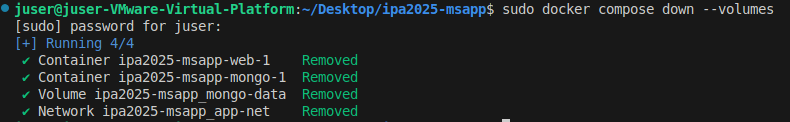

# ipa2025-msapp
this is a github repository about docker composing

### How to set-up your environment?
- sudo apt update
- sudo apt install python3-pip
- python3 -m pip install -r requirements.txt
- dont forget to configure env file for future credentials.

### If you want to change the username password don't forget to down/up your docker compose
- docker compose down --volumes
